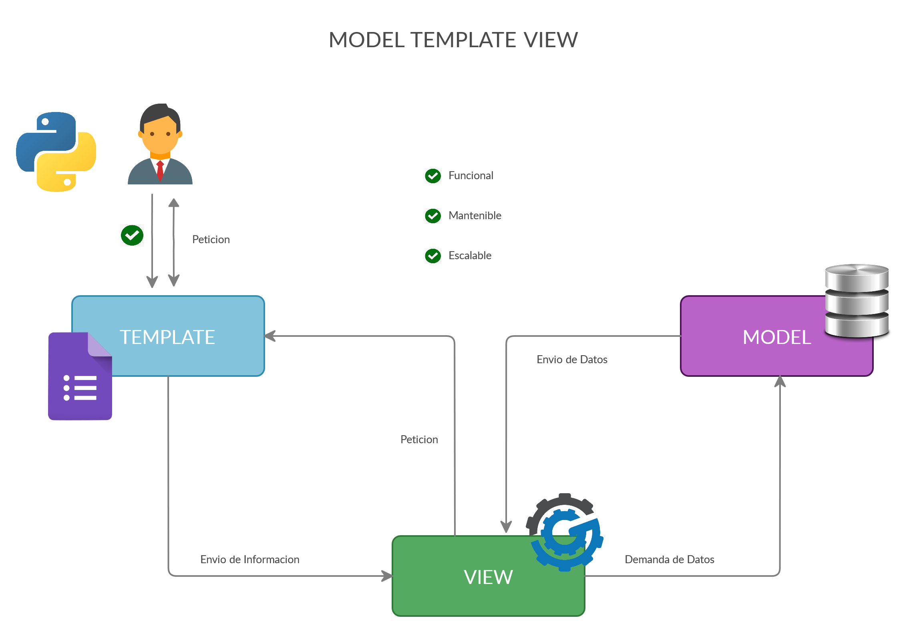
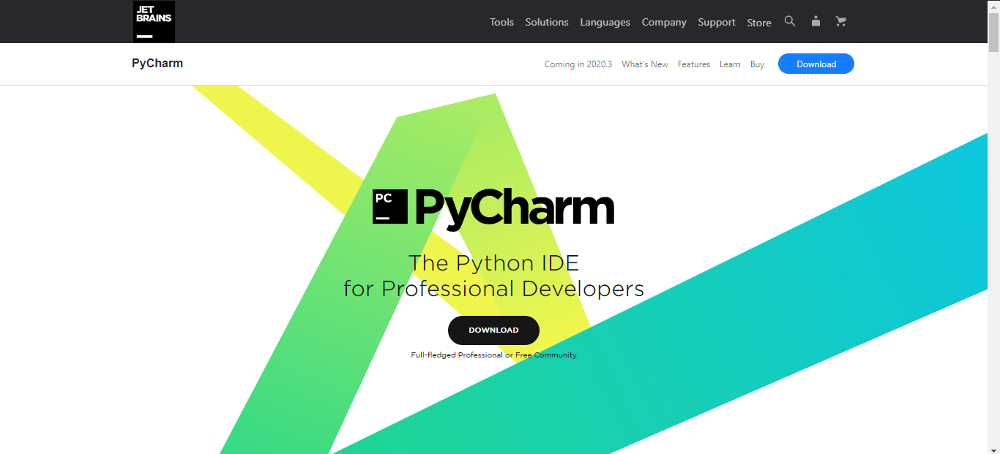
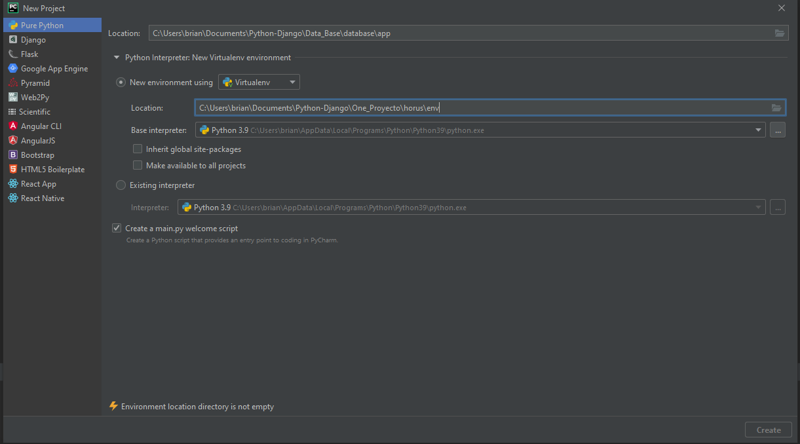
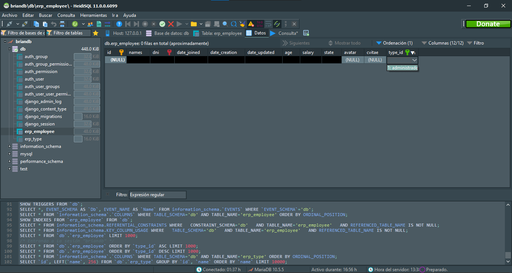
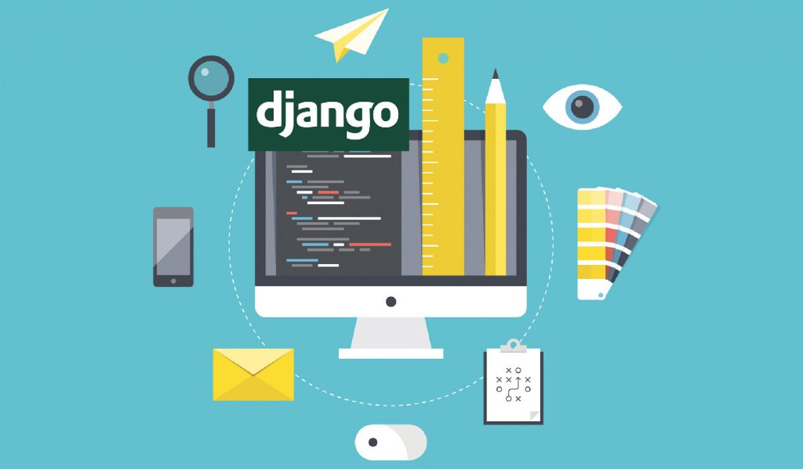

<h2 align="center">🦄Framework Web - Learn Django &nbsp;:heart:&nbsp;</h2>


## ¿Que es Django? 💻

Django es un framework de desarrollo web de código abierto, escrito en Python, que respeta el patrón de diseño conocido como MVC (Modelo–Vista–Controlador). Fue desarrollado en origen para gestionar varias páginas orientadas a noticias de la World Company de Lawrence, Kansas, y fue liberada al público bajo una licencia BSD en julio de 2005; el framework fue nombrado en alusión al guitarrista de jazz gitano Django Reinhardt. En junio de 2008 fue anunciado que la recién formada Django Software Foundation se haría cargo de Django en el futuro.

La meta fundamental de Django es facilitar la creación de sitios web complejos. Django pone énfasis en el re-uso, la conectividad y extensibilidad de componentes, el desarrollo rápido y el principio No te repitas (DRY, del inglés Don't Repeat Yourself). Python es usado en todas las partes del framework, incluso en configuraciones, archivos, y en los modelos de datos.

## Framework

Un Framework es un marco de trabajo formado por un conjunto de herramientas, librerias y buenas practicas.

## ¿Para qué Sirve Django?

- Para crear sitios web (Complejos) de forma rapida y sencilla
- Hay tareas que son repetitivas, pesadas y comunes en el momento de crear deferentes sitios web, django viene a facilitar la realizacion de estas tareas.
- Hay codigos que podemos reutilizar de un sitio web a otro, Django tambien nos permite esta reutilizacion de forma sencilla.

##  Modelo Vista Controlador (Model Template View)


## Características

- Un mapeador objeto-relacional.
- Aplicaciones "enchufables" que pueden instalarse en cualquier página gestionada con Django.
- Una API de base de datos robusta.
- Un sistema incorporado de "vistas genéricas" que ahorra tener que escribir la lógica de ciertas tareas comunes.
- Un sistema extensible de plantillas basado en etiquetas, con herencia de plantillas.
- Un despachador de URLs basado en expresiones regulares.
- Soporte de internacionalización, incluyendo traducciones incorporadas de la interfaz de administración.

## Comandos

_Install Django_

[www.djangoproject.com](https://www.djangoproject.com/download/)
```
📦 pip install Django==X.X.X
```
_Actualiza Django_
```
📦 pip install --upgrade django==X.X.X
```
_Version de Django_

```
📦 import django | django.VERSION
```

_Primer Projecto_

```
📦 django-admin startproject nombreProyecto
```

_Ejecutar Servidor Django_

```
📦 python manage.py runserver
```
_Crear Aplicacion_

```
📦 python manage.py startapp nombreAplicacion
```

_Check de la Aplicacion_

```
📦 python manage.py check nombreAplicacion
```

_Generar la Base de Datos_

```
📦 python manage.py makemigrations
```

_Generar Codigo SQL_

```
📦 python manage.py sqlmigrate nombreAplicacion 000n
```
_Migrate_

```
📦 python manage.py migrate
```

_Shell_

```
📦 python manage.py shell
```

_mysqlclient_

```
📦 pip install mysqlclient
```

## Crear Super Usuario

```
📦 python manage.py createsuperuser
```

## Conector PostgreSQL

_Driver_
```
📦 pip install psycopg2
```

_Libreria_
```
📦 pip install mysqlclient
```
```python
DATABASES = {
    'default': {
        'ENGINE': 'django.db.backends.postgresql_psycopg2',
        'NAME': 'articulosclientes',
        'USER': 'briandb',
        'PASSWORD': 'briandb',
        'HOST': '127.0.0.1',
        'DATABASE_POR
}
```

## Conector Mysql/MariaDb 

```
📦 pip3 install mariadb
```

```
📦 pip install mysqlclient
```

```python
DATABASES = {
    'default': {
        'ENGINE': 'django.db.backends.mysql',
        'NAME': 'articulosclientes',
        'USER': 'briandb',
        'PASSWORD': 'briandb',
        'HOST': '127.0.0.1',
        'PORT': 3307,
    }
}
```
## Conector SQLSERVER

_Driver_
```
https://www.microsoft.com/es-es/download/details.aspx?id=56567

```
_Libreria_

```
📦 pip install pyodbc
```

_Conectar Python Django con SQL Server_

```python
DATABASES = {
    'default': {
        'ENGINE': 'sql_server.pyodbc',
        'NAME': 'db_almacen',
        'USER': 'usr_almacen',
        'PASSWORD': 'mipassword',
        'HOST': '127.0.0.1',
        'PORT': '1433',

        'OPTIONS': {
            'driver': 'ODBC Driver 13 for SQL Server',
        },
    }
}
```

## Insertar datos BBDD - Consola

```python
from nombreAplicacion.models import nombreTabla
art=nombreTabla(inten1='nombre', iten2='nombre', iten3=numero)
art.save()
#art2= nombreTabla.objects.create(iten1="nombre", iten2="campo", iten3=numero)   
```
## Actualizar datos BBDD - Consola

```python
from nombreAplicacion.models import nombreTabla
art.precio=100 
art.save
```

## Borrar datos BBDD - Consola

```python
from nombreAplicacion.models import nombreTabla
variableborrar=nombeTabla.objects.get(id=3) 
variableborrar.delete()
```
## Email
_Incresar en el Archivo Setting_

```python
EMAIL_BACKEND = 'django.core.mail.backends.smtp.EmailBackend'
EMAIL_HOST="smtp.gmail.com"
EMAIL_USE_TLS=True
EMAIL_PORT=587
EMAIL_HOST_USER="tuemail@gmail.com"
EMAIL_HOST_PASSWORD="tupassword"
EMAIL_USE_TLS = True
EMAIL_USE_SSL = False
```

- Ingresar al Shell para las Pruebas
```
from django.core.mail import send_mail   
```
```
send_mail('el asusntoo', 'mensaje del correo, 'tu correo', ['correo destinatario'], fail_silently=False,)
```
## Arquitectura

Aunque Django está fuertemente inspirado en la filosofía de desarrollo Modelo Vista Controlador, sus desarrolladores declaran públicamente que no se sienten especialmente atados a observar estrictamente ningún paradigma particular, y en cambio prefieren hacer "lo que les parece correcto". Como resultado, por ejemplo, lo que se llamaría "controlador" en un "verdadero" framework MVC se llama en Django "vista", y lo que se llamaría "vista" se llama "plantilla". [WIKIPEDIA](https://es.wikipedia.org/wiki/Django_(framework)).<br>

- Presentacion
- Control
- Mediator
- Entity
- Foundation

## Jerarquia u orden de llamadas desde plantilla

-   Diccionario
-   Atributo
-   Metodo
-   Indice de lista

## Instalador

📦 [Install Django](https://www.djangoproject.com/) Intalador de Django.<br>
📦 [Install PyCham](https://www.jetbrains.com/es-es/pycharm/download/#section=windows) Intalador de PyCham.<br>
📦 [Install Python](https://www.python.org/) Instalador de Python.<br>

## Django BBDD

Soportados Oficialmente:
- SQLite3 : Gestor de BBDD por defecto
- PostgreSQL: Gestor Recomendado
- MySql
- Oracle

Con conectores ofrecidos por terceros:
- SQL Server
- SAP SQL
- DB2
- Firebird

## SQL

```
- Renombrar Database
Alter database nombredatabase rename to nombreactualizado;
```

## API FORM

```
from nombreAplicacion.forms import FormularioContacto 
miformulario = FormularioContacto()
```
_Mostrar Formulario_
print(miformulario)

## Proyecto vs Aplicacion


# Pycharm

_Pagina Principal_ [ JETBRAINS](https://www.jetbrains.com/es-es/pycharm/).<br>



## Configuración Entorno Pycharm

_Pantalla de creacion de Proyecto_



- Carpeta
    -   app : Aqui se coloca todos lo archivos
    -   env : Aqui Se coloca la version Python

## Models 

Un modelo es la fuente única y definitiva de información sobre sus datos. Contiene los campos y comportamientos esenciales de los datos que está almacenando. Generalmente, cada modelo se asigna a una sola tabla de base de datos.
[DOCS.DJANGOPROJECT](https://docs.djangoproject.com/en/3.1/topics/db/models/).<br>




## ORM

Un ORM es un modelo de programación que permite mapear las estructuras de una base de datos relacional (SQL Server, Oracle, MySQL, etc.), en adelante RDBMS (Relational Database Management System), sobre una estructura lógica de entidades con el objeto de simplificar y acelerar el desarrollo de nuestras aplicaciones.S

## Spotify Django
Music Python [List on Spotify](https://open.spotify.com/playlist/11AwbhmXyh2jKlsHmaxcP9)




